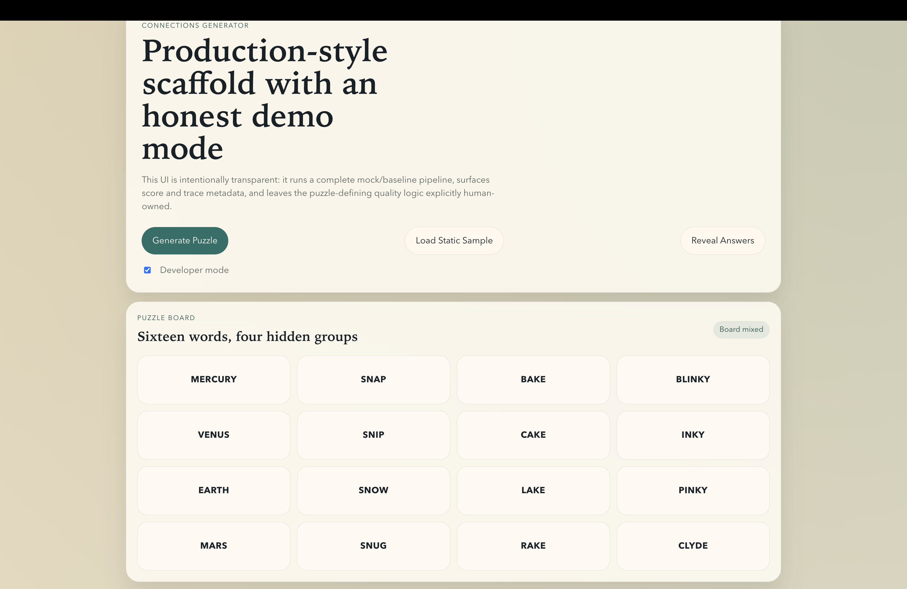

# Connections Puzzle Generator



End-to-end product showcase for the current repository state: demo puzzle generation, reveal flow, score inspection, ambiguity/debug outputs, and top-k batch-evaluation browsing.

Production-style scaffold for a NYT-Connections-style puzzle generator. The repository now has:

- a first-stage end-to-end demo generation pipeline
- a second-stage quality-control scaffold for ambiguity modeling, solver ensemble analysis, style-analysis hooks, batch evaluation, and top-k debug browsing

The project is intentionally honest: demo mode runs end-to-end, but the project-defining puzzle-quality heuristics remain human-owned and explicitly unimplemented.

## Product Showcase

The image above reflects the current developer-facing product shell for this repository.

### What the showcase demonstrates

- a playable demo-style puzzle board with 16 words arranged in a mixed board layout
- solution reveal panels showing the four hidden groups and their metadata
- a score panel with coherence, ambiguity penalty, leakage estimate, and style-analysis placeholder values
- a developer debug panel that surfaces ambiguity reports, solver ensemble output, style-analysis output, and generation trace data
- a Top-K panel that reads persisted batch-evaluation results and lets you inspect the current best accepted puzzles

### Product surfaces currently scaffolded

- `Generate Puzzle`
  Runs the current demo pipeline through FastAPI and returns a generated puzzle payload.
- `Load Static Sample`
  Loads a bundled sample payload for stable UI and API contract inspection.
- `Reveal Answers`
  Shows group labels, rationales, and grouped words for the current puzzle.
- `Developer Mode`
  Displays ensemble disagreement, ambiguity evidence, style signals, and latest batch-evaluation summary.
- `Batch Evaluation Outputs`
  Persists accepted puzzles, rejected puzzles, top-k rankings, summary metrics, and optional traces under `data/processed/eval_runs/`.


## Current Scope

### Generation scaffold

- FastAPI backend with typed schemas, repositories, orchestration, generators, solver, verifier, and scorer wiring
- React + TypeScript + Vite frontend for puzzle generation, reveal, score inspection, and developer-mode debug views
- seed/sample/demo data plus bootstrap and local run scripts

### Second-stage quality-control scaffold

- ambiguity evidence models and baseline ambiguity reports
- solver registry plus ensemble coordinator
- baseline second solver for agreement/disagreement exercise
- style-analysis placeholder reports
- offline batch evaluation with accepted/rejected/top-k persistence
- debug endpoint and frontend Top-K inspection panel

## Guiding Principle

This repository does **not** claim that ambiguity detection, NYT-likeness, ranking quality, or final solver behavior are solved.

Anything project-defining remains clearly marked with `TODO[HUMAN_*]`, rich docstrings, and either:

- a human-owned stub
- a baseline/mock implementation explicitly labeled as provisional

## Local Setup

### 1. Copy environment variables

```bash
cp .env.example .env
```

### 2. Create a backend Python environment

Recommended: use `venv` inside `backend/`.

```bash
cd backend
/opt/homebrew/bin/python3 -m venv .venv
source .venv/bin/activate
python -m pip install --upgrade pip
python -m pip install -e ".[dev]"
```


### 3. Install frontend dependencies

```bash
cd ../frontend
npm install
```

### 4. Bootstrap demo artifacts

```bash
cd ..
python3 scripts/bootstrap_demo_data.py
```

## Running Locally

Use two terminals.

### Terminal 1: backend

```bash
cd backend
source .venv/bin/activate
python -m uvicorn app.main:create_app --factory --reload --host 0.0.0.0 --port 8000
```

### Terminal 2: frontend

```bash
cd frontend
npm run dev -- --host 0.0.0.0 --port 5173
```

Then open [http://localhost:5173](http://localhost:5173).

Useful backend URLs:

- [http://localhost:8000/api/v1/health](http://localhost:8000/api/v1/health)
- [http://localhost:8000/api/v1/puzzles/sample](http://localhost:8000/api/v1/puzzles/sample)
- [http://localhost:8000/api/v1/debug/evaluation/latest](http://localhost:8000/api/v1/debug/evaluation/latest)

## Demo Mode

Demo mode is enabled by default through `CONNECTIONS_DEMO_MODE=true`.

In demo mode the system:

- loads seed words from JSONL
- extracts baseline mock features
- produces mock semantic / lexical / phonetic / theme groups
- composes a 16-word puzzle
- runs a solver ensemble scaffold
- emits a baseline ambiguity report
- emits a baseline style-analysis report
- scores the puzzle with a transparent mock scorer
- supports offline batch evaluation and top-k persistence

## Batch Evaluation

Run a batch evaluation:

```bash
python3 scripts/evaluate_batch.py --num-puzzles 10 --top-k 5
```

Artifacts are written under:

```text
data/processed/eval_runs/<run_id>/
```

Typical outputs:

- `config.json`
- `summary.json`
- `accepted.json`
- `rejected.json`
- `top_k.json`
- `traces.json` when traces are enabled

## Human-Owned Implementation Map

The following modules are intentionally scaffolded but not solved:

- `backend/app/features/human_feature_strategy.py`
- `backend/app/generators/semantic.py`
- `backend/app/generators/lexical.py`
- `backend/app/generators/phonetic.py`
- `backend/app/generators/theme.py`
- `backend/app/pipeline/builder.py`
- `backend/app/solver/human_ambiguity_strategy.py`
- `backend/app/solver/verifier.py` via `InternalPuzzleVerifier`
- `backend/app/scoring/style_analysis.py` via `HumanStyleAnalyzer`
- `backend/app/scoring/human_scoring_strategy.py`

See [`docs/human_owned_components.md`](docs/human_owned_components.md) for the exact ownership map.

## Repository Layout

```text
backend/   FastAPI app, pipeline, schemas, services, solver/scoring scaffolds, tests
frontend/  React + TypeScript + Vite UI shell and developer-facing debug panels
data/      Seed words, processed artifacts, sample payloads, evaluation runs
docs/      Architecture, schemas, API contract, TODO maps
scripts/   Bootstrap, demo generation, batch evaluation, local run helpers
```

## Key Docs

- [`docs/architecture.md`](docs/architecture.md) - architecture and pipeline overview
- [`docs/api_contract.md`](docs/api_contract.md) - backend API shapes and debug endpoint notes
- [`docs/data_schema.md`](docs/data_schema.md) - schema reference for puzzle, trace, ambiguity, ensemble, style, and batch models
- [`docs/human_owned_components.md`](docs/human_owned_components.md) - exact human-owned modules, functions, and responsibilities

## Development Commands

- `make bootstrap-demo`
- `make backend-dev`
- `make frontend-dev`
- `make demo-generate`
- `make evaluate-batch`
- `make test-backend`
- `make lint-backend`
- `make typecheck-frontend`

## TODO Roadmap

The repository scaffold is in place. The remaining work is concentrated in the human-owned puzzle-quality pipeline.

### TODO 1 — MVP Generation Path

Build the first real generation path that produces non-mock puzzles end to end.

Priority modules:

- `backend/app/features/human_feature_strategy.py`
- `backend/app/generators/semantic.py`
- `backend/app/pipeline/builder.py`

Implementation goals:

- implement semantic-oriented feature extraction
- implement the first real semantic group generator
- implement the first real puzzle composer
- produce valid 16-word puzzles from real `GroupCandidate` outputs instead of mock-only generation

Expected deliverables:

- a usable semantic feature store
- real semantic `GroupCandidate` outputs with rules, evidence, and local scores
- real composed `PuzzleCandidate` outputs with 4 groups and 16 unique words

Success criteria:

- the system generates non-mock semantic-heavy puzzles
- each generated group is human-interpretable
- composed puzzles are structurally valid and usable by downstream quality-control modules

---

### TODO 2 — Quality-Control Core

Turn the current quality-control scaffold into a real filtering pipeline.

Priority modules:

- `backend/app/solver/human_ambiguity_strategy.py`
- `backend/app/solver/verifier.py`
- `backend/app/scoring/human_scoring_strategy.py`

Implementation goals:

- implement word leakage analysis and alternative-group detection
- implement final verification policy for accept / reject / borderline decisions
- implement a real scoring breakdown for ranking accepted puzzles

Expected deliverables:

- `AmbiguityReport` with real evidence
- `VerificationResult` with meaningful reject reasons and warning flags
- `PuzzleScore` with usable ranking signals and component breakdowns

Success criteria:

- obviously ambiguous puzzles are rejected or penalized
- accepted/rejected batch outputs become informative
- top-k results are meaningfully better than unsorted outputs

---

### TODO 3 — Generator Diversity Upgrade

Expand beyond semantic-heavy generation and move closer to NYT-style variety.

Priority modules:

- `backend/app/generators/lexical.py`
- `backend/app/generators/theme.py`
- `backend/app/pipeline/builder.py` (composer mix logic)

Implementation goals:

- implement lexical pattern / template group generation
- implement curated theme / trivia group generation
- upgrade composer heuristics to prefer stronger cross-type mixes

Expected deliverables:

- lexical `GroupCandidate` outputs
- theme `GroupCandidate` outputs
- more diverse puzzle compositions using multiple group mechanisms

Success criteria:

- puzzles are no longer dominated by plain semantic category groups
- generator mix includes lexical and theme groups in a controlled way
- accepted puzzles begin to look more like curated Connections boards

---

### TODO 4 — A+ Enhancements

Add higher-risk, higher-upside features once the MVP path and quality-control core are stable.

Priority modules:

- `backend/app/generators/phonetic.py`
- `backend/app/scoring/style_analysis.py`
- batch evaluation and historical calibration workflows

Implementation goals:

- implement a small number of high-precision phonetic / wordplay groups
- calibrate style-analysis against historical Connections patterns
- improve ranking and acceptance policy using batch-evaluation evidence

Expected deliverables:

- phonetic `GroupCandidate` outputs with strong interpretability
- stronger style-analysis signals
- improved accepted-puzzle quality under batch generation

Success criteria:

- the system produces occasional strong wordplay/theme puzzles
- style-analysis becomes more than a placeholder
- batch-generated top-k puzzles are plausibly closer to NYT editorial style

---

## Recommended Implementation Order

To avoid wasted effort, the recommended execution order is:

1. semantic feature extraction
2. semantic generator
3. puzzle composer
4. ambiguity evaluator
5. verifier
6. scorer
7. lexical generator
8. theme generator
9. batch-evaluation tuning
10. phonetic generator
11. historical style calibration

This ordering reflects project leverage:

- generation must exist before ranking and rejection are meaningful
- quality control must exist before large-batch evaluation is useful
- lexical/theme diversity should be added after the semantic core is stable
- phonetic and style-calibration work are best treated as later-stage A+ upgrades

---

## Current Strategic Focus

The current repository already has strong scaffolding for:

- demo generation
- solver ensemble infrastructure
- ambiguity / style / evaluation data models
- batch evaluation persistence
- top-k browsing and developer debug surfaces

The current bottleneck is no longer repository structure.

The main remaining challenge is implementing the human-owned logic that determines:

- what makes a strong group candidate
- what makes a puzzle non-ambiguous
- what should be rejected
- what should rank highest
- what actually feels plausibly NYT-like
