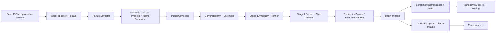

# Architecture

## Summary

The repository is organized around a deliberately layered generation pipeline:

1. Seed word loading and normalization
2. Feature extraction
3. Group proposal by generator family
4. Puzzle composition
5. Solver ensemble and ambiguity modeling
6. Verification, filtering, and scoring
7. Batch evaluation and top-k persistence
8. External benchmark audit and blind review scaffolding
9. API delivery and frontend inspection

The current implementation has two service-wired modes:

- demo mode using baseline/mock components
- an opt-in Stage 2 mixed-generation mode with real feature extraction,
  semantic generation, lexical/theme generation, mixed composition, and Stage 1
  quality-control

The remaining editorial-quality judgment still remains explicitly human-owned or provisional, but
the repository now includes a real Stage 3 phonetic generator, interpretable style-analysis layer,
and reproducible local calibration artifacts.

## Module Boundaries

- `backend/app/config`
  Central settings and path resolution.
- `backend/app/schemas`
  Typed contracts for words, groups, puzzles, verification, scoring, and traces.
- `backend/app/domain`
  Abstract protocols and value objects shared across the pipeline.
- `backend/app/dataio`
  File and SQLite I/O for seed words and processed features.
- `backend/app/features`
  Feature extraction strategies.
- `backend/app/generators`
  Group proposal strategies for semantic, lexical, phonetic, and theme families.
- `backend/app/pipeline`
  Puzzle composition and orchestration.
- `backend/app/solver`
  Solver adapters, ensemble coordination, ambiguity scaffolds, and verification strategies.
- `backend/app/scoring`
  Ranking logic, score breakdowns, style analysis, calibration helpers, and
  NYT benchmark audit utilities.
- `backend/app/services`
  API-facing orchestration, metadata services, and offline batch evaluation services.
- `frontend/src`
  UI for generation, reveal, scoring, and debug inspection.

## Request / Data Flow

## Delivery And Validation Flow

Stage 4 keeps the architecture intact and hardens how the existing pipeline is
validated and delivered:

1. run backend and frontend locally through the existing service boundaries
2. run offline batch evaluation through `scripts/evaluate_batch.py`
3. persist raw evaluation and calibration artifacts under `data/processed/eval_runs`
4. synthesize a reviewer-facing bundle with `scripts/build_release_summary.py`
5. optionally normalize the public benchmark and run the NYT audit scripts
6. validate the repository with `scripts/release_check.py` and CI

## Generation Pipeline

### Phase 1

- Build or load the word feature database.
- Run four generator families to produce `GroupCandidate` objects.

### Phase 2

- Integrate a solver backend.
- Add a solver ensemble scaffold and ambiguity evidence capture.
- Verify structural validity and reject obviously invalid puzzles.

### Phase 3

- Add coherence and ambiguity scoring.
- Add interpretable style-analysis signals and richer ranking/debug metadata.
- Support offline batch evaluation with accepted/rejected/top-k outputs plus calibration summaries.

### Phase 4

- Surface generation through a web UI.
- Expose score and trace metadata in developer mode.

## Demo Mode Principles

- Demo mode must run end-to-end.
- Demo mode must not misrepresent project-defining quality logic as finished.
- Baseline components should be deterministic, auditable, and easy to replace.

## Semantic Baseline Principles

- semantic baseline mode should preserve the same service contracts and debug surfaces as demo mode
- implemented semantic, lexical, and theme logic should stay explainable and traceable
- mixed-board selection should use explicit soft preferences for mechanism diversity
  while preserving semantic-only fallback when mixed candidates are weaker
- deterministic tie-breaking and content-derived ids should make repeated runs
  with the same semantic request materially reproducible for tests and batch
  evaluation
- ambiguity, verification, and scoring now run through an implemented Stage 1 policy layer
- style analysis and calibration bands are now implemented as local, interpretable baselines
  while final editorial calibration remains provisional

## Future Extensibility

- deepen `HumanCuratedFeatureExtractor` beyond the current deterministic semantic baseline
- deepen lexical/theme coverage beyond the current high-precision Stage 2 inventory
- deepen the current phonetic inventory and style target bands with richer curated references
- Add multiple solver backends behind the same `SolverBackend` contract.
- Persist offline evaluation data using the existing schema and trace metadata.
- calibrate or extend the Stage 1 ambiguity/verifier/scoring policy without changing the batch or API contracts
- refine the current Stage 3 style-analysis baseline rather than replacing it with a black-box scorer
- improve benchmark mechanism labeling or human-review tooling without reopening the core generation pipeline

## Related Docs

- `docs/evaluation_methodology.md`
- `docs/release_candidate_validation.md`
- `docs/stage4_release_hardening.md`
