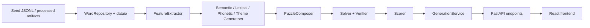

# Architecture

## Summary

The repository is organized around a deliberately layered generation pipeline:

1. Seed word loading and normalization
2. Feature extraction
3. Group proposal by generator family
4. Puzzle composition
5. Solver-backed verification
6. Filtering and scoring
7. API delivery and frontend inspection

The current implementation runs in demo mode using baseline/mock components, while the high-value puzzle quality logic remains explicitly human-owned.

## Module Boundaries

- `backend/app/config`
  Central settings and path resolution.
- `backend/app/schemas`
  Typed contracts for words, groups, puzzles, verification, scoring, and traces.
- `backend/app/domain`
  Abstract protocols and value objects shared across the pipeline.
- `backend/app/dataio`
  File and SQLite I/O for seed words and processed features.
- `backend/app/features`
  Feature extraction strategies.
- `backend/app/generators`
  Group proposal strategies for semantic, lexical, phonetic, and theme families.
- `backend/app/pipeline`
  Puzzle composition and orchestration.
- `backend/app/solver`
  Solver adapters and verification strategies.
- `backend/app/scoring`
  Ranking logic and score breakdowns.
- `backend/app/services`
  API-facing orchestration and metadata services.
- `frontend/src`
  UI for generation, reveal, scoring, and debug inspection.

## Request / Data Flow

## Generation Pipeline

### Phase 1

- Build or load the word feature database.
- Run four generator families to produce `GroupCandidate` objects.

### Phase 2

- Integrate a solver backend.
- Verify structural validity and reject obviously invalid puzzles.

### Phase 3

- Add coherence and ambiguity scoring.
- Rank puzzle candidates with richer diagnostics.

### Phase 4

- Surface generation through a web UI.
- Expose score and trace metadata in developer mode.

## Demo Mode Principles

- Demo mode must run end-to-end.
- Demo mode must not misrepresent project-defining quality logic as finished.
- Baseline components should be deterministic, auditable, and easy to replace.

## Future Extensibility

- Swap `MockWordFeatureExtractor` for `HumanCuratedFeatureExtractor`.
- Replace per-family mock generators with human-owned strategies one by one.
- Add multiple solver backends behind the same `SolverBackend` contract.
- Persist offline evaluation data using the existing schema and trace metadata.
